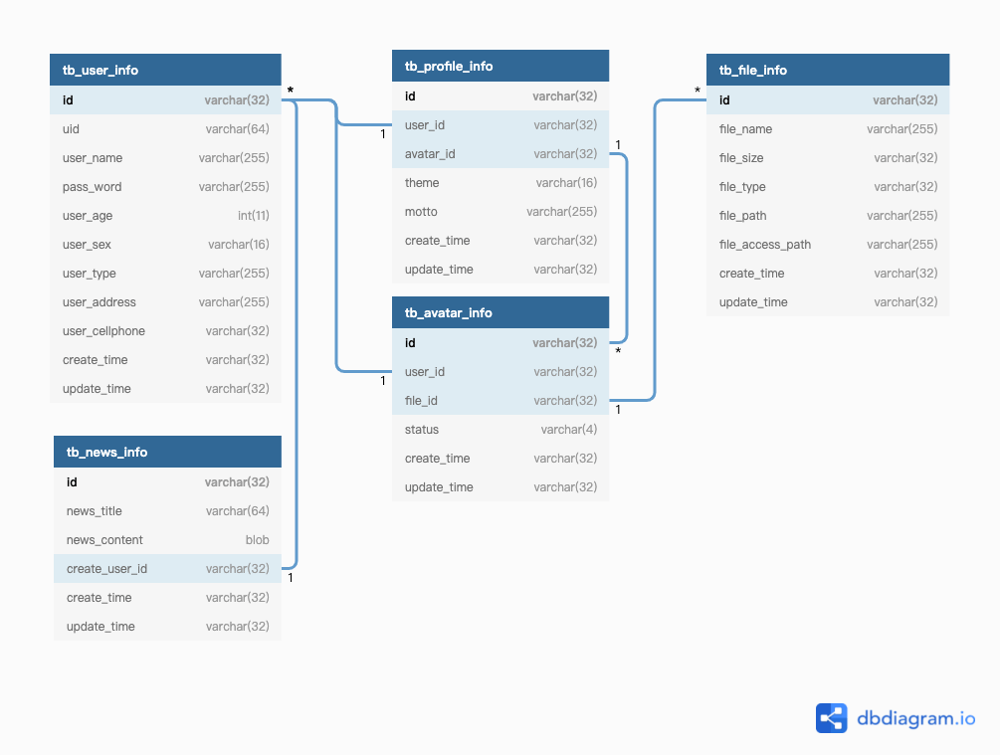

[简体中文](./README.md) | [English](./README.en.md)

### Koa2 + Typescript 构建的后端项目，全栈工程师必学（嘘！防止后端人员跑路时，没人写接口的尴尬局面）！！！

前端项目地址：https://github.com/supervons/ExploreRN

1. 登录注册；
2. 接口鉴权；
3. 基于 redis 列表查询加速；
4. 修改密码、用户信息；
5. 头像上传修改；

### 项目启动-开发

```
npm install
npm run start
```

### 项目 pm2 部署

```
npm run build
npm run pro
```

### 项目结构

```
.
├── src
│   ├── controller        //controller层
│   ├── entity            //实体类
│   ├── redis             //redis相关配置及工具类
│   ├── router            //路由配置
│   ├── service           //service层
│   ├── config.ts         //配置文件
│   ├── constants.ts      //项目常量
│   └── index.ts          //项目入口index.js
├── .env                  //配置文件
├── ecosystem.config.js   //pm2配置
├── ormconfig.json        //数据库 ORM 配置文件
├── nodemon.json          //nodemon配置
├── package.json          //npm 安装包
└── tsconfig.json         //ts配置文件
```

### 数据库表结构



### 数据库文件位置

```
./public/mysql.sql
```

### 已完成

- [x] 项目基础搭建
- [x] 登录注册
- [x] 接口鉴权 - JWT
- [x] 修改密码、用户信息

### 待开发

- [ ] log4j 日志中间件
- [ ] 基于 redis 列表查询加速
- [ ] 头像上传修改
